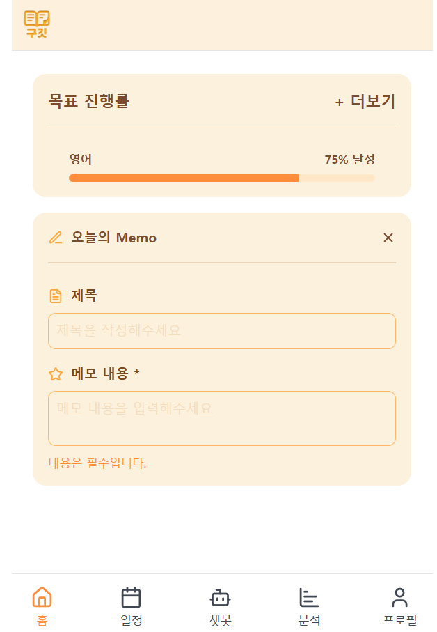

## Explain this Pull Request 🙏

해당 Push는 오늘의 메모 팝업을 위해 생성되었으며,
이전에 PR을 요청한 오늘의 TODO 팝업과 일부 동일한 컴포넌트(ActionButton,DatePickerSection)이 있어
해당 부분을 제외하고 업로드하였습니다.

- Jira URL:https://9git-9git.atlassian.net/browse/SCRUM-108

## What has fixed? 🛠

변경 전 내용

변경 후 내용
오늘의 메모 팝업 제작

## Whether needed review 🖍

<!-- 마크다운의 빈 체크박스 문법은 [ ] / 채워진 체크박스 문법은 [x] 입니다. -->

- [x] 🙋🏻 리뷰가 필요합니다!
- [ ] 🙅🏻 리뷰가 필요하지 않습니다!

(이유 : 오늘의 메모 팝업 코드 리뷰)

## Document🗒️ (Optional)

## Screenshot 📸 (Optional)

## Test Checklist ✅ (Optional)

<!-- 마크다운의 빈 체크박스 문법은 [ ] / 채워진 체크박스 문법은 [x] 입니다. -->
